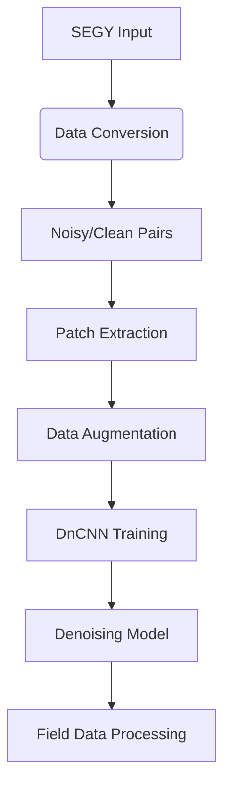

# SeisInvDiff - Seismic Data Denoising using Deep Learning


## Description
SeisInvDiff is a deep learning framework for seismic data denoising using a Deep Convolutional Neural Network (DnCNN). The project provides tools for processing SEGY-formatted seismic data, training denoising models, and applying noise reduction to field data. The implementation focuses on removing random noise while preserving geological features in seismic records.

## Key Features
- DnCNN architecture with configurable depth (17 layers by default)
- SEGY data processing and conversion utilities
- Data augmentation with 8 different transformation modes
- Patch-based processing for handling large seismic volumes
- SNR-based evaluation metrics
- Pre-trained models for immediate use
- Training progress visualization (loss/SNR curves)
- Support for CUDA acceleration

## Installation
1. Clone the repository:
```bash
git clone https://github.com/littlepenguin66/SeisInvDiff.git
cd SeisInvDiff
```

2. Install dependencies:
```bash
pip install -r requirements.txt
```

3. Prepare directory structure:
```bash
mkdir -p data/{label,seg_eage_salt_data,sgy_data/{clean,noise},feature}
```

## Usage

### Training the Model
```python
python model/train.py
```
- Configure training parameters in `train.py`:
  - Epochs (default: 20)
  - Batch size (default: 32)
  - Learning rate (default: 0.001)
  - Validation split (default: 10%)

### Denoising Seismic Data
```python
python model/denoise_test.py
```
- Pre-trained model: `model/save_dir/model_epoch20.pth`
- Outputs visualization comparing:
  - Original noisy data
  - Denoised result
  - Removed noise component

### Data Preparation
1. Place SEGY files in `data/sgy_data/`
2. Convert to numpy format:
```python
python utils/sgy_to_npy.py
```

## Configuration Options
Key adjustable parameters:
```python
# In train.py
epochs = 20          # Training iterations
batch_size = 32      # Samples per batch
LR = 0.001           # Learning rate

# In GetPatches.py
patch_size = 64      # Training patch dimension
scales = [1]         # Data augmentation scales
stride_x = 32        # Horizontal patch stride
stride_y = 64        # Vertical patch stride
```

## Contribution Guidelines
Contributions are welcome in these areas:
- Improved network architectures
- Enhanced data augmentation strategies
- Additional seismic processing utilities
- Documentation improvements
- Performance optimizations

1. Fork the repository
2. Create your feature branch
3. Commit changes with descriptive messages
4. Push to the branch
5. Open a Pull Request

## Testing
Validate denoising performance:
```python
python model/denoise_test.py
```
The test script will:
1. Load a pre-trained model
2. Process sample data
3. Generate comparison plots in `pictures/after/`

## License
Distributed under the MIT License - see [LICENSE](LICENSE) file for details.

## Acknowledgements
- DnCNN architecture implementation based on original paper by Zhang et al.
- SEGY processing using segyio library
- Core modified from 夜剑听雨

## Data Flow


For questions or support, please open an issue in the GitHub repository.
